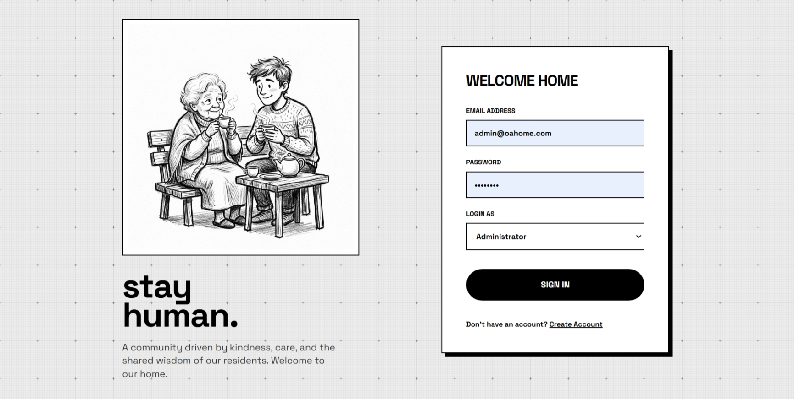
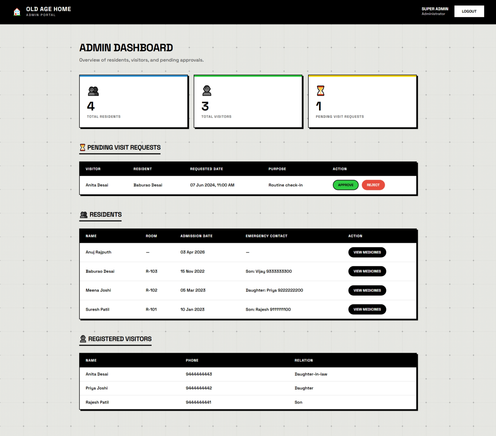
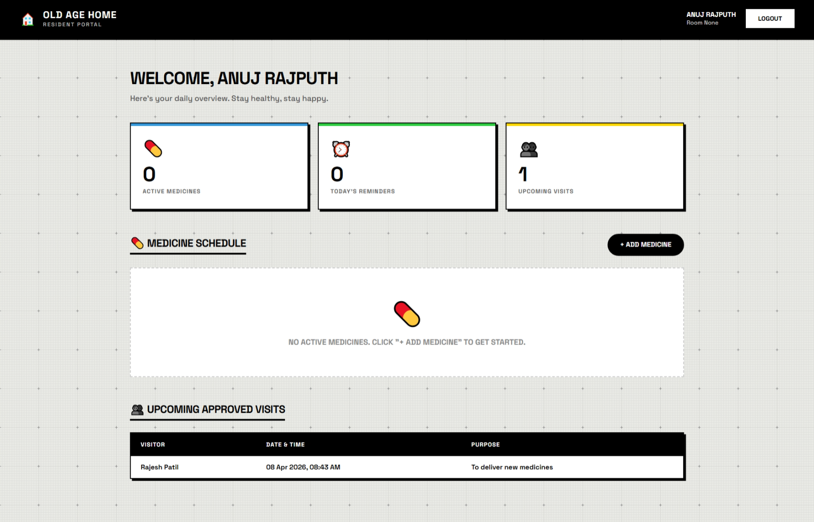
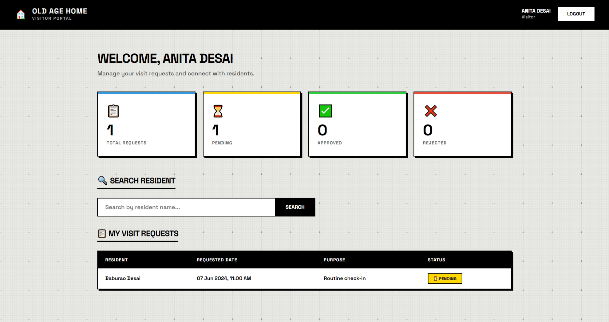

# 🏠 Old Age Home Management System

A full-stack web application built with **Flask** and **PostgreSQL** to manage residents, visitors, medicine schedules, and visit requests for an old age home facility.

---

## 📸 Screenshots

### 🔐 Login Page


### 🛡️ Admin Dashboard


### 🛏️ Resident Dashboard


### 👥 Visitor Dashboard


---

## 🚀 Features

### 👨‍💼 Admin
- View total active residents and registered visitors
- See all pending visit requests with visitor & resident names
- **Approve** or **Reject** visit requests in one click
- View detailed medicine schedules of any resident via API
- Role-protected dashboard with session-based authentication

### 🛏️ Resident
- View personal room number and stats (active medicines, upcoming visits)
- **Add medicine schedules** (name, dosage, frequency, reminder time)
- **Mark medicines as taken** with timestamp logging
- View upcoming approved family/visitor visits

### 👥 Visitor
- **Search for residents** by name (case-insensitive)
- **Submit visit requests** with preferred date/time and purpose
- Track all personal visit requests (Pending / Approved / Rejected)
- View request history in chronological order

---

## 🛠️ Tech Stack

| Layer       | Technology                     |
|-------------|--------------------------------|
| Backend     | Python 3, Flask 3.1.3          |
| Database    | PostgreSQL 14+                 |
| DB Driver   | psycopg2-binary 2.9.10         |
| Templating  | Jinja2 3.1.6                   |
| Frontend    | HTML5, CSS3 (Vanilla)          |
| Sessions    | Flask Session (server-side)    |
| Auth        | Role-based (Admin/Resident/Visitor) |

---

## 📁 Project Structure

```
Old_Age_Home_Managment_System/
│
├── app/
│   ├── app.py                  # Main Flask application & core routes
│   ├── config.py               # Database configuration & connection
│   ├── requirements.txt        # Python dependencies
│   │
│   ├── routes/
│   │   ├── __init__.py
│   │   ├── admin.py            # Admin blueprint (dashboard, approve/reject visits)
│   │   ├── resident.py         # Resident blueprint (medicines, visit view)
│   │   ├── visitor.py          # Visitor blueprint (search, request visits)
│   │   └── auth.py             # Auth helpers
│   │
│   ├── templates/
│   │   ├── login.html          # Unified login/register page
│   │   ├── admin_dashboard.html
│   │   ├── resident_dashboard.html
│   │   └── visitor_dashboard.html
│   │
│   ├── static/
│   │   ├── css/                # Stylesheets
│   │   └── images/             # Static images
│   │
│   ├── db/
│   │   └── old_age_home_db.sql # Full DB schema + seed data
│   │
│   └── asset/                  # Additional project assets
│
├── screenshot/                 # Application screenshots
│   ├── login_page.png
│   ├── admin_page.png
│   ├── resident_page.png
│   └── vistor_page.png
│
├── venv/                       # Python virtual environment (gitignored)
├── .gitignore
└── README.md
```

---

## 🗄️ Database Structure

The system uses **PostgreSQL** with 6 interrelated tables.

### Entity Relationship Overview

```
admin ──────────────────────────────────────────────┐
                                                     │ approved_by
resident ──────────────────── visit_request ◄────────┘
    │                              ▲
    │                              │
    │                          visitor
    │
    └──── medicine_schedule ──── medicine_log
```

---

### 📋 Table Details

#### 1. `admin`
Stores admin/staff accounts who manage the facility.

| Column       | Type           | Description                    |
|--------------|----------------|--------------------------------|
| `admin_id`   | SERIAL (PK)    | Unique admin identifier        |
| `name`       | VARCHAR(100)   | Full name                      |
| `email`      | VARCHAR(100)   | Unique email (login)           |
| `password`   | VARCHAR(255)   | Password                       |
| `phone`      | VARCHAR(15)    | Contact number                 |
| `created_at` | TIMESTAMP      | Account creation time          |

---

#### 2. `resident`
Stores details of elderly residents living in the facility.

| Column             | Type           | Description                          |
|--------------------|----------------|--------------------------------------|
| `resident_id`      | SERIAL (PK)    | Unique resident identifier           |
| `name`             | VARCHAR(100)   | Full name                            |
| `email`            | VARCHAR(100)   | Unique email (login)                 |
| `password`         | VARCHAR(255)   | Password                             |
| `phone`            | VARCHAR(15)    | Contact number                       |
| `dob`              | DATE           | Date of birth                        |
| `gender`           | VARCHAR(10)    | Male / Female / Other                |
| `room_number`      | VARCHAR(10)    | Assigned room (e.g., R-101)          |
| `admission_date`   | DATE           | Date of joining (default: today)     |
| `emergency_contact`| VARCHAR(100)   | Emergency person & contact           |
| `status`           | VARCHAR(10)    | Active / Inactive                    |
| `created_at`       | TIMESTAMP      | Record creation time                 |

---

#### 3. `visitor`
Stores details of family members or friends who visit residents.

| Column       | Type           | Description                    |
|--------------|----------------|--------------------------------|
| `visitor_id` | SERIAL (PK)    | Unique visitor identifier      |
| `name`       | VARCHAR(100)   | Full name                      |
| `email`      | VARCHAR(100)   | Unique email (login)           |
| `password`   | VARCHAR(255)   | Password                       |
| `phone`      | VARCHAR(15)    | Contact number                 |
| `relation`   | VARCHAR(50)    | Relation to resident (Son, etc.)|
| `created_at` | TIMESTAMP      | Account creation time          |

---

#### 4. `medicine_schedule`
Tracks medicines prescribed/assigned to each resident.

| Column          | Type           | Description                                  |
|-----------------|----------------|----------------------------------------------|
| `medicine_id`   | SERIAL (PK)    | Unique medicine entry identifier             |
| `resident_id`   | INT (FK)       | References `resident.resident_id`            |
| `medicine_name` | VARCHAR(150)   | Name of the medicine                         |
| `dosage`        | VARCHAR(100)   | Dosage (e.g., 5mg, 500mg)                    |
| `frequency`     | VARCHAR(30)    | Once/Twice/Three times a day, Weekly, As needed |
| `reminder_time` | TIME           | Scheduled reminder time                      |
| `start_date`    | DATE           | When to start taking                         |
| `end_date`      | DATE           | When to stop (NULL = ongoing)                |
| `is_active`     | BOOLEAN        | Whether schedule is currently active         |
| `created_at`    | TIMESTAMP      | Record creation time                         |

> **Foreign Key:** `resident_id` → `resident(resident_id)` ON DELETE CASCADE

---

#### 5. `medicine_log`
Records whether a resident actually took their medicine for each schedule entry.

| Column        | Type           | Description                         |
|---------------|----------------|-------------------------------------|
| `log_id`      | SERIAL (PK)    | Unique log entry identifier         |
| `medicine_id` | INT (FK)       | References `medicine_schedule`      |
| `taken_date`  | DATE           | Date of dose                        |
| `taken_time`  | TIME           | Time when taken (NULL if missed)    |
| `is_taken`    | BOOLEAN        | TRUE if taken, FALSE if missed      |
| `notes`       | VARCHAR(255)   | Optional notes (e.g., "asleep")     |

> **Foreign Key:** `medicine_id` → `medicine_schedule(medicine_id)` ON DELETE CASCADE

---

#### 6. `visit_request`
Manages visit requests submitted by visitors to meet a resident.

| Column               | Type           | Description                             |
|----------------------|----------------|-----------------------------------------|
| `request_id`         | SERIAL (PK)    | Unique request identifier               |
| `visitor_id`         | INT (FK)       | References `visitor(visitor_id)`        |
| `resident_id`        | INT (FK)       | References `resident(resident_id)`      |
| `requested_datetime` | TIMESTAMP      | Preferred visit date and time           |
| `purpose`            | VARCHAR(255)   | Reason for the visit                    |
| `status`             | VARCHAR(10)    | Pending / Approved / Rejected           |
| `approved_by`        | INT (FK)       | Admin who acted on it                   |
| `approved_at`        | TIMESTAMP      | When admin took action                  |
| `created_at`         | TIMESTAMP      | When request was submitted              |

> **Foreign Keys:**
> - `visitor_id` → `visitor(visitor_id)` ON DELETE CASCADE
> - `resident_id` → `resident(resident_id)` ON DELETE CASCADE
> - `approved_by` → `admin(admin_id)` ON DELETE SET NULL

---

## ⚙️ Setup & Installation

### Prerequisites
- Python 3.10+
- PostgreSQL 14+
- Git

### 1. Clone the Repository

```bash
git clone https://github.com/your-username/Old_Age_Home_Managment_System.git
cd Old_Age_Home_Managment_System
```

### 2. Create & Activate Virtual Environment

```bash
# Create
python -m venv env

# Activate (Windows)
env\Scripts\activate

# Activate (macOS/Linux)
source env/bin/activate
```

### 3. Install Dependencies

```bash
pip install -r app/requirements.txt
```

### 4. Setup the Database

Open **pgAdmin** or **psql** and run:

```sql
CREATE DATABASE "Old_Age_Management_System_db";
```

Then execute the full schema + seed data:

```bash
psql -U postgres -d Old_Age_Management_System_db -f app/db/old_age_home_db.sql
```

### 5. Configure Database Connection

Edit `app/config.py` with your PostgreSQL credentials:

```python
class Config:
    DB_NAME = "Old_Age_Management_System_db"
    DB_USER = "postgres"
    DB_PASSWORD = "your_password_here"
    DB_HOST = "localhost"
    DB_PORT = "5432"
```

### 6. Run the Application

```bash
cd app
python app.py
```

Open your browser and go to: **http://127.0.0.1:5000**

---

## 🔑 Default Login Credentials (Seed Data)

| Role     | Email                   | Password  |
|----------|-------------------------|-----------|
| Admin    | admin@oahome.com        | admin123  |
| Admin    | ramesh@oahome.com       | staff123  |
| Resident | suresh@resident.com     | res123    |
| Resident | meena@resident.com      | res123    |
| Resident | baburao@resident.com    | res123    |
| Visitor  | rajesh@visitor.com      | vis123    |
| Visitor  | priya@visitor.com       | vis123    |
| Visitor  | anita@visitor.com       | vis123    |

---

## 🔌 API Endpoints

| Method | Route                                | Description                              |
|--------|--------------------------------------|------------------------------------------|
| GET    | `/`                                  | Redirect to login                        |
| GET    | `/login`                             | Login page                               |
| POST   | `/login`                             | Authenticate & redirect by role          |
| POST   | `/register`                          | Register new resident or visitor         |
| GET    | `/logout`                            | Clear session & redirect                 |
| GET    | `/resident/dashboard`                | Resident's personal dashboard            |
| POST   | `/resident/medicines/add`            | Add a new medicine schedule              |
| POST   | `/resident/medicines/take/<id>`      | Mark medicine as taken                   |
| GET    | `/visitor/dashboard`                 | Visitor's personal dashboard             |
| GET    | `/visitor/search?q=<name>`           | Search for residents by name             |
| POST   | `/visitor/request-visit`             | Submit a new visit request               |
| GET    | `/admin/dashboard`                   | Admin overview dashboard                 |
| POST   | `/admin/approve_visit/<id>`          | Approve a pending visit request          |
| POST   | `/admin/reject_visit/<id>`           | Reject a pending visit request           |
| GET    | `/admin/api/resident_medicines/<id>` | JSON — medicines of a specific resident  |

---

## 🔐 Authentication & Authorization

- All routes use **Flask sessions** for authentication
- Each role (Admin, Resident, Visitor) has a **custom decorator** (`login_required_admin`, `login_required_resident`, `login_required_visitor`) that enforces role-based access
- Unauthorized access redirects to the login page with a flash error message

---

## 📦 Dependencies

```
Flask==3.1.3
psycopg2-binary==2.9.10
Jinja2==3.1.6
Werkzeug==3.1.8
itsdangerous==2.2.0
blinker==1.9.0
click==8.3.1
colorama==0.4.6
MarkupSafe==3.0.3
```

---

## 🤝 Contributing

1. Fork the repository
2. Create a new branch: `git checkout -b feature/your-feature`
3. Commit your changes: `git commit -m "Add your feature"`
4. Push to the branch: `git push origin feature/your-feature`
5. Open a Pull Request

---

## 📄 License

This project is for academic/educational purposes.

---

> Built with ❤️ using Flask & PostgreSQL
